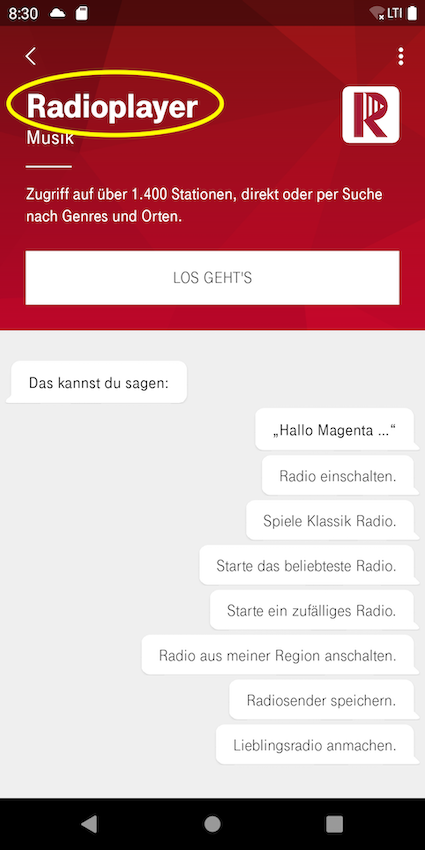
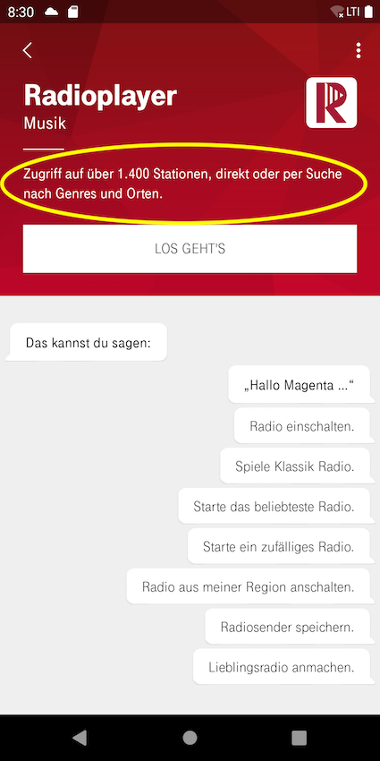
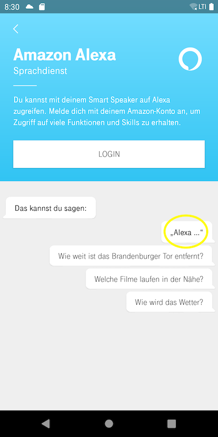
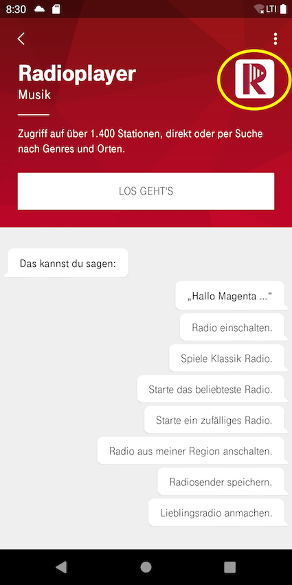
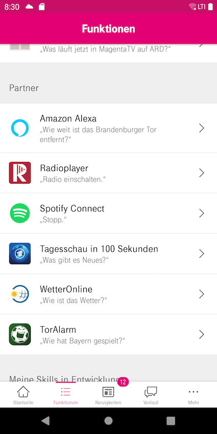
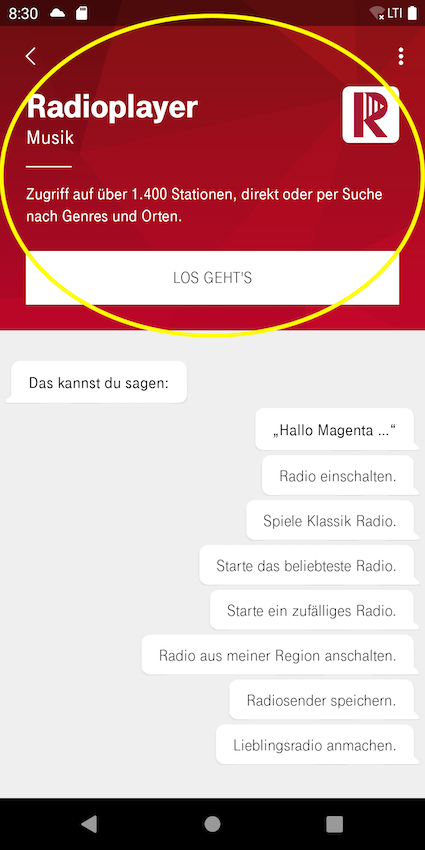
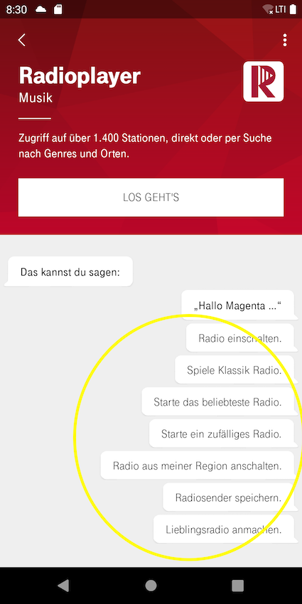
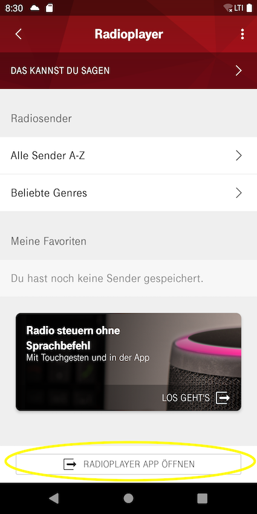
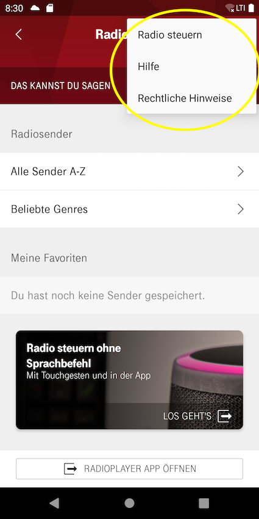

# Catalog json for Companion app (Hallo Magenta! app)

This documentation explains how you can configure your skill inside SDP to have nice user experience on Hallo Magenta app.

Have a look at the sample catalog.json 

```json
{
   "fileVersion":1,
   "v2":{
      "showsInCatalog":true,
      "cappBehavior":"cappBehaviorId",
      "displayName":"name of the skill",
      "headline":"headline for the skill on skill detail page",
      "description":"description of the skill displayed on skill detail page",
      "setupButton":"text on the setup button",
      "wakeWord":"special wake word the skill is using which is displayed on the sample utterances screen",
      "iconUrl":"cloudimage://picture.service/app_skill/skill-Icon.png?v=1",
      "iconOnWhiteUrl":"cloudimage://picture.service/app_skill/skill-IconOnWhiteBackground.png?v=1",
      "design":{
         "backgroundColor":"#e20074",
         "gradientBackgroundColor":"#c70065",
         "backgroundImageUrl":"cloudimage://picture.service/app_skill/skill_Background.png?v=1"
      },
      "examplePhrases":[
         "Example Phrase 1.",
         "Example Phrase 2.",
         "Example Phrase n."
      ],
      "pairingPhrase":"a special phrase that the user has to say to the speaker if a explicit pairing is necessary",
      "appExternal":{
         "buttonName":"buttonName text",
         "iOSUrl":"deeplink url to the app on iOS",
         "iOSInstallUrl":"https://itunes.apple.com/de/app/... (url to the iOS app in App Store)",
         "androidPackageName":"package name of the android app in play store"
      },
      "menuActions":{
         "helpAndService":{
            "name":"documentName",
            "url":"https://... or cloudfile://... -> url to the document wich should be opened",
            "type":"DOCUMENT|JSON|WEB"
         },
         "legal":{
            "name":"documentName",
            "url":"https://... or cloudfile://... -> url to the document wich should be opened",
            "type":"DOCUMENT|JSON|WEB"
         },
         "termsAndConditions":{
            "name":"documentName",
            "url":"https://... or cloudfile://... -> url to the document wich should be opened",
            "type":"DOCUMENT|JSON|WEB"
         },
         "impressum":{
            "name":"documentName",
            "url":"https://... or cloudfile://... -> url to the document wich should be opened",
            "type":"DOCUMENT|JSON|WEB"
         },
         "privacy":{
            "name":"documentName",
            "url":"https://... or cloudfile://... -> url to the document wich should be opened",
            "type":"DOCUMENT|JSON|WEB"
         },
         "faq":{
            "name":"documentName",
            "url":"https://... or cloudfile://... -> url to the document wich should be opened",
            "type":"DOCUMENT|JSON|WEB"
         },
         "helpDocumentTouchGestures":{
            "name":"documentName",
            "url":"https://... or cloudfile://... -> url to the document wich should be opened",
            "type":"DOCUMENT|JSON|WEB"
         }
      },
      "adCard":{
         "imageUrl":"cloudimage://picture.service... url to the background image of the add card",
         "title":"title of the add card",
         "subtitle":"subtitle of the adcard",
         "url":"https://... deeplink of the adCard",
         "appExternal":{
            "buttonName":"buttonName text",
            "iOSUrl":"deeplink url to the app on iOS",
            "iOSInstallUrl":"https://itunes.apple.com/de/app/... (url to the iOS app in App Store)",
            "androidPackageName":"package name of the android app in play store"
         }
      },
      "adCardLaterUse":{
         "imageUrl":"cloudimage://picture.service... url to the background image of the add card",
         "title":"title of the add card",
         "subtitle":"subtitle of the adcard",
         "buttonText":"text to display on the adCard button",
         "document":{
            "name":"documentName",
            "url":"https://... or cloudfile://... -> url to the document wich should be opened",
            "type":"DOCUMENT|JSON|WEB"
         }
      },
      "walkthrough":{
         "title":"title of walkthrough item",
         "subtitle":"subtitle of walkthrough item",
         "order":0,
         "examplePhrases":[
            1
         ]
      },
      "pairing":{
         "authStrategy":"genericOAuth|idmScopeOAuth",
         "config":{
            "scope":"some oauth scope",
            "cviTokenName":"name of the token in cvi",
            "clientId":"some oauth clientId",
            "clientSecret":"some oauth clientSecret",
            "redirectUri":"some oauth redirectUri",
            "discoveryUrl": "server url for the oauth2 url discovery call"
            "oAuthUrl":"oauth url used to get access and refresh tokens",
            "authorizationUrl":"oauth url to the authorization website",
            "targetScope":"some oauth scope in the case that the authStrategy was 'idmScopeOAuth'",
            "offlineAccess":true,
            "userFeatureFlags":[
               "userFeatureFlag 1",
               "userFeatureFlag 2"
            ],
            "useSingleSignOn":true
         }
      },
      "migrationConfig":{
         "vpp":"vppId to migrate to",
         "skillId":"skillId to migrate to"
      }
   }
}
```

## Generally there are 2 fields in the highest structure:

* "fileVersion" (mandatory) this is a number indicating the version of the catalog. It should be increased whenever a new/changed version is published.
* "v2" (mandatory) is basically the container object for all the skill-config content. It is used to group all the currently supported contents. In the past a different structure of the skill-config was used and to enable backward compatibility the "v2" container was used to promote the new structure to new app versions. Today apps that use the old structure are not running at customer devices. That is why the old structure is not needed to be in the catalog.json anymore.

### Content fields used in "v2"

#### "showsInCatalog" (mandatory)
This flag determines whether the skill should be displayed in the CApp list of skills or not.

#### "cappBehavior" (optional - only for internal use)
This is an identifier for a special behavior for the skill inside the CApp. With that the CApp can provide special functionality to a specific skill, that is different to a standard skill.

#### "displayName" (mandatory)
The name of the skill to be displayed in the CApp.



#### "headline" (mandatory)
Headline or the category of the skill on skill detail page.


#### "description" (mandatory)
Description of the skill displayed on skill detail page.



#### "wakeWord" (optional)
This is a special wake word the skill is using. It is displayed on the sample utterances screen.



#### "iconUrl" (mandatory)
This is a download url of an image to display as a skill icon in the CApp. The best way to provide an image to the CApp is by using the picture service and providing a picture service url.



#### "iconOnWhiteUrl" (optional)
This is a download url of an image to display as a skill icon in the CApp whenever the background of the image is going to be white. The best way to provide an image to the CApp is by using the picture service and providing a picture service url.



#### "design" (mandatory)
This is an object defining design related information. The following fields are included:

**"backgroundColor" (mandatory)**

A string representing a RGB color value (format #rrggbb) to use as a skill background color.

**"gradientBackgroundColor" (optional)**

A string representing a RGB color value (format #rrggbb) to use as a second skill background color, if the background should show a gradient.

**"backgroundImageUrl" (optional)**

This is a download url of an image to display as a skill background on the skill page in the CApp. The best way to provide an image to the CApp is by using the picture service and providing a picture service url.



#### "examplePhrases" (mandatory)
This is an array of strings which contains example phrases that the user can say to the speaker to use the skill. (commands that the skill can handle) The list of example phrases is displayed in the CApp.



#### "appExternal" (optional)
This is an object defining an external link to an App that is related to the skill and may give further functionality. The following fields are included:

**"buttonName" (mandatory)**

The text that should be displayed on the button in the CApp. (e.g. "Radioplayer App öffnen")

**"iOSUrl" (mandatory)**

The iOS link to the app, to start the app if it is already installed.

**"iOSInstallUrl" (mandatory)**

The iOS link to the app in the AppStore.

**"androidPackageName" (mandatory)**

The Android link to the app, to start the app if it is already installed or the app page in the PlayStore if it is not installed.



#### "menuActions" (optional)
This is object containing different possibilities to display different context menus in the CApp. Each Context menu can be used to open an external PDF document or an website. (JSON is just for advanced usage) Each item under menuActions is defined as an "DocumentItem".

"DocumentItem" structure

* "name" (optional) - the display name of the document
* "url" (mandatory) - the download URL of the DPF document or the website URL
* "type" (mandatory) - "DOCUMENT" if it is a PDF document | "WEB" if it is a website URL | "JSON" if it is a specific formatted JSON file (only for internal use)

The following documents are supported:

* "helpAndService" - for a help document, displayed as "Hilfe"
* "legal" - for a legal terms document, displayed as "Rechtliche Hinweise"
* "termsAndConditions" - for a terms and conditions document, displayed as "AGB"
* "impressum" - for an imprint document, displayed as "Impressum"
* "privacy" - for a data privacy terms document, displayed as "Datenschutz"
* "faq" - for a FAQ document, displayed as "Häufige Fragen"
* "helpDocumentTouchGestures" - for a help document regarding touch gestures, displayed as "Touchpad-Gesten"



#### "adCard" (optional)
This is an object containing information that define everything necessary to display an advertisement card on the skill page ftu. This object contains the following fields:

**"imageUrl" (mandatory)**

URL to a image that is used as a background of the ad card. The best way to provide an image to the CApp is by using the picture service and providing a picture service url which ist e.g. "cloudimage://picture.service/app_skill/skill-IconOnWhiteBackground.png?v=1".

**"title" (mandatory)**

This is a text that should be displayed as title on the ad card.

**"subtitle" (optional)**

This is a text that should be displayed as subtitle on the ad card.

**"url" (optional)**

URL to the website that should be opened when the user clicks on the ad card. If this is defined "appExternal" field is not needed.

**"appExternal" (optional)**
This is an object defining an external link to an App that is related to the skill and may give further functionality when the user clicks on the ad card. If this is defined, "url" field is not needed. The following fields are included:

* "iOSUrl" (mandatory)
    * The iOS link to the app, to start the app if it is already installed.

* "iOSInstallUrl" (mandatory)
    * The iOS link to the app in the AppStore.

* "androidPackageName" (mandatory)
    * The Android link to the app, to start the app if it is already installed or the app page in the PlayStore if it is not installed.


#### "pairing" (optional)
This is an object containing all necessary information for a oauth2 login of the skill. It contains the following fields:

**"authStrategy" (mandatory)**

Defines how the login should be done in the app, since there is a special behavior implemented for all telekom logins. For a normal oauth2 flow "genericOAuth" should be used. The option "idmScopeOAuth" is only used for Telekom logins and only for internal use. 

**"config" (mandatory)**

This object contains all configurations for the login flow, including:

* "scope" (optional)
    * The scope of the oauth2 login flow. Is only used if authStrategy="genericOAuth".

* "cviTokenName" (mandatory)
    * This is the name of the token within CVI, so the skill is able to get the tokens later on by using this id.

* "clientId" (mandatory)
    * The client id of the oauth2 login flow.

* "clientSecret" (mandatory)
    * The client secret of the oauth2 login flow.

* "redirectUri" (mandatory)
    * The URL that should be called after authorization (on the website) finished and to jump back to the CApp. The value should be "smarthub://login" for a default behavior. (every other redirect URL would need to be registered in the CApp and is not working out of the box)

* "authorizationUrl" (optional)
    * The authorization URL which is the URL to the oauth2 login website (necessary parameters are added by the CApp, so this should only be the base URL). Is only used if authStrategy="genericOAuth"

* "oAuthUrl" (optional)
    * The server URL to use to get the access and refresh tokens with the authorization code. Is only used if authStrategy="genericOAuth"

* "discoveryUrl" (optional)
    * URL to make the server call for the oauth2 discovery of the needed URLs. Is only used if authStrategy="idmScopeOAuth", so it is only for internal use. If set the authorizationUrl and oAuthUrl are not needed.

* "targetScope" (optional)
    * The scope of the oauth2 login flow. Is only used if authStrategy="idmScopeOAuth", so it is only for internal use.

* "offlineAccess" (optional)
    * Boolean value defines whether offline access should be enabled or not. Is only used if authStrategy="idmScopeOAuth", so it is only for internal use.

* "userFeatureFlags" (optional)
    * Array of strings defining the feature flags that the skill is using and which should be checked for to determine if the user account has enabled these features. Is only used if authStrategy="idmScopeOAuth", so it is only for internal use.

* "useSingleSignOn" (optional)
    * Boolean flag that indicates whether the CApp should try to provide a single sign on functionality by enabling cookies for the login.
