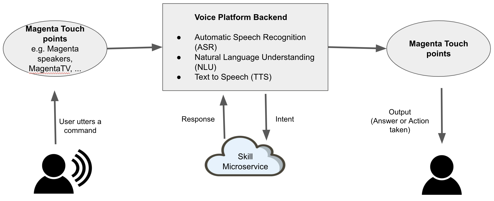

# Building skills for Magenta Speakers

## Voice Pipeline

To understand how the flow of your command works, let's go through an overview of what happens when you give a command to the Magenta Voice assistant. Below is an example of a weather 'skill':

- You speak `Hallo Magenta, Wie ist das Wetter heute in Mannheim?` to the Magenta Speaker.
- Magenta Smart Speaker listens to the phrase `Hallo Magenta` and starts sending your command to the Speech Recognizer in the cloud (Voice Platform).
- The Automatic Speech Recognizer (ASR) using the Machine Learning tools sends its output to the Natural Language Understanding (NLU) component.
- The NLU determines which skill domain and skill does the command belong to and forwards it to that specific skill - in this example, it is the weather skill implemented as part of the global skill domain WEATHER.
- The weather skill queries a backend weather forecasting service with the entities "today" and "Mannheim".
- The result is converted in a suitable response type by the Voice Platform and sent back to you - in this example, voice answer by Magenta Assistant and Text link (weather forecast of Mannheim) to the Hallo Magenta mobile app.

The diagram below shows the interaction:



It is also important to understand a few terminologies before you can jump onto creating a skill.
 
## Terminologies

#### Skills

Skills are a set of (intelligent) capabilities that make the voice assistant smart. For example, you can ask the voice assistant to call your mobile contacts or set an alarm (speakers as touch point), or switch on the Magenta TV (set top boxes, remote controlled units as touch points). Technically, it is a service which is called by the Voice Platform in order to perform some business logic. A Skill is part of (or a building block of) a Voice Application.

#### Common Voice Interface (CVI)

Name of the central component of the Voice Platform usually referred to as the Core. It is the entry point for the backend for all commands in natural language and helps in orchestrating the voice flow between various platform components (ASR, NLU, TTS) and calling the appropriate skills via REST APIs. It also manages the dialog with the user by keeping a track of the 'Context' and enrich with the user data.

#### Intents

An Intent is a core action that the user means when speaking in Natural Language. It represents a task or action the user wants to perform.

An 'intent' triggers a 'skill' call in the Voice Platform. 

#### Skill Domains

The Skill Domains are constructed to encapsulate multiple skills serving the same tasks, and supporting the same intents. The domain to skill relation is 1:n where one of the skills is set as default.

In programming lingo, Domains are abstract skills and skills are implementation of domains. A user can use the favourite skill implementation for the skill domain.

#### Entities

Important words in the user command relevant to an intent - 'parameters' to the skill. For eg.

"What's the weather tomorrow in Berlin?"

The Voice Platform will identify one intent (get the weather) and two entities:

* a time parameter - with the value "tomorrow"
* a location parameter - with the value "Berlin"

You can read more about entities [here](entities.md) 

#### Hybrid Skill

A hybrid skill is a type of skill which requires a local plugin (also called as "local kit") to be deployed on a touch point to work. For example:

* the Deezer bot requires a local Deezer plugin running on the speaker, to manage the Deezer DRM.
* the DECT skill requires a local plugin on the Magenta smart speaker to pilot the DECT chipset of the speaker.

Further information [here](use_kits_and_actions.md)

#### Context

Skill invocation request consists of two data transfer object (DTO): a request context and request session. The context carries data about an intent being invoked (intent name, attributes, tokens, etc), while the session carries data that persists between user interactions.

Before calling an intent handler function, SDK injects the context object into the global address space. Global context object is importable from smarthub_sdk.intents module (this is a thread-safe instance referring to currently running request's context):

```
>>> from voice_sdk.intents import context
>>> context
<voice_sdk.intents.LocalContext object at 0x7faa1bc75910>
```

You can read more about context [here](context.md)

#### Responses

Any valid call of an intent handler may return Response type object. If a call of the intent is valid, the requested user action processed as intended. Furthermore, it covers any exception from the normal processing that is handled by notifying the client/user about the result. In other words: Everything that is not an unrecoverable error.

You can read more about responses [here](response.md)

#### Internationalization and Localization

Here is a [detailed information](i18n.md) about how to use translations for the implementation of a skill.

## Skill Lifecycle

Let's jump right into the implementation and configuration of a skill.

The lifecycle of developing a skill and integrating (configuring) the skill in the voice chain is divided in 5 phases:

1. [Skill Provider Registration](external_developers/skill_provider_registration.md)
    * Inviting users as Skill Providers on Skill Development Portal (SDP) to create new skills in the tool under existing domains.
2. [Skill Initiation](external_developers/skill_initiation.md)
    * Inviting users as Skill Developers for skills (on SDP) and their configurations created by Skill Providers. Skill configuration can be changed and managed by Skill Developers after this step.
3. [Skill Development](external_developers/skill_development.md)
    * Implementing a skill as a micro-service, deploying it as a web application and testing it end to end using the voice assistant
4. [Skill Publishing](external_developers/skill_publishing.md)
    * Bringing the skill to production for all the users
5. [Skill Deletion](external_developers/skill_deletion.md)
    * Deleting skill configurations from SDP
