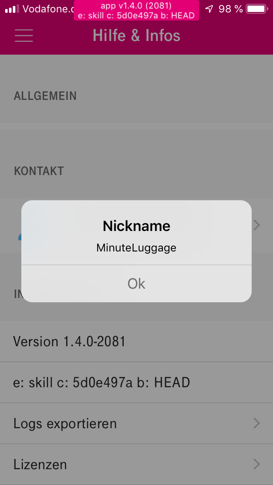
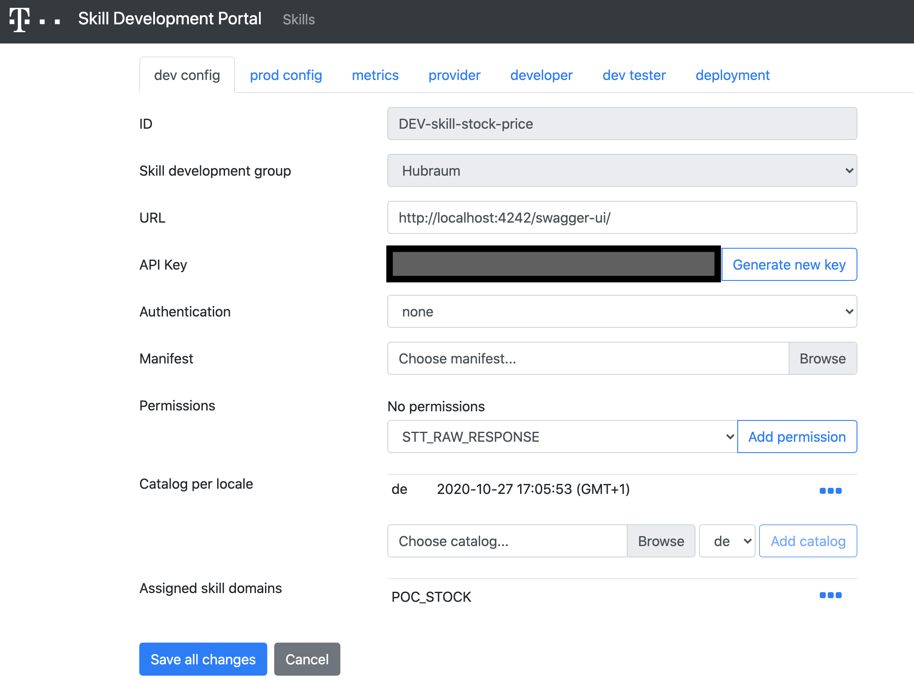
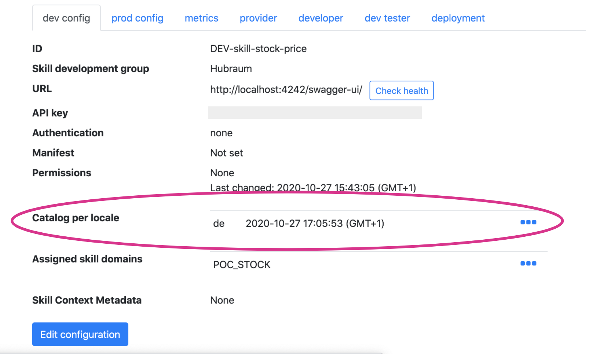

# Telekom Voicification Suite

## Overview

We understand Voice as a key enabler for seamless processes, personalised experiences and conversational AI solutions for companies and their consumers.

Telekom Voicification Suite is a combined offering of:

1. Voice Platform as a Service (VPaaS) that includes tools to add skills to Magenta Speakers, build new Voice Assistants, integrate voice to mobile applications and much more. 
2. Various Voice Applications built on top of the Voice Platform. These can be used with multiple touch points like Magenta Smart Speakers, Magenta TV, voice integrated mobile apps, etc.
3. Last but not the least the professional services offered to help build voice empowered applications and integrate voice technology in custom B2C and B2B solutions.

The picture below shows the platform offered components, the applications and services offered as part of Telekom Voicification Suite. Most of the components and services are customizable and can be used with or without other provided services.


## Voice Platform as a Service (VPaaS)

Magenta Voice Platform is a technical platform that enables flexible processing of voice interactions. It consists of tools used for the development of Voice Applications both for B2C (Business to Consumer) and B2B (Business to Business) consumers:

1. Basic services like Cloud Infrastructure to host and deploy your applications in containers, Common Voice Interface (referred to as the Core) that is the heart of the Voicification suite orchestrating the invocation of various tasks being performed at the application layer.
2. Additional intelligent services like natural language understanding components, automated speech recognizer, etc.
3. The software development kits that provide you with the way to build custom applications on top of the platform and integrate existing applications or touch points with voice technology.

The voice platform is provided as a service to its consumers. Using VPaaS, you can:

- Create voice skills (capabilities) for the touch points like Magenta Speakers
- Integrate voice to mobile applications
- Enable voice in hardware or IoT devices
- Develop innovative enterprise solutions
- Extend Telekom Voicification Suite itself by adding custom product lines in the Application Catalog

### Building skills for Magenta Speakers

#### Voice Pipeline

To understand how the flow of your command works, let's go through an overview of what happens when you give a command to the Magenta Voice assistant. Below is an example of a weather 'skill':

- You speak `Hallo Magenta, Wie ist das Wetter heute in Mannheim?` to the Magenta Speaker.
- Magenta Smart Speaker listens to the phrase `Hallo Magenta` and starts sending your command to the Speech Recognizer in the cloud (Voice Platform).
- The Automatic Speech Recognizer (ASR) using the Machine Learning tools sends its output to the Natural Language Understanding (NLU) component.
- The NLU determines which skill domain and skill does the command belong to and forwards it to that specific skill - in this example, it is the weather skill implemented as part of the global skill domain WEATHER.
- The weather skill queries a backend weather forecasting service with the entities "today" and "Mannheim".
- The result is converted in a suitable response type by the Voice Platform and sent back to you - in this example, voice answer by Magenta Assistant and Text link (weather forecast of Mannheim) to the Hallo Magenta mobile app.

The diagram below shows the interaction:


It is also important to understand a few terminologies before you can jump onto creating a skill.
 
#### Terminologies

**Skills**

Skills are a set of (intelligent) capabilities that make the voice assistant smart. For example, you can ask the voice assistant to call your mobile contacts or set an alarm (speakers as touch point), or switch on the Magenta TV (set top boxes, remote controlled units as touch points). Technically, it is a service which is called by the Voice Platform in order to perform some business logic. A Skill is part of (or a building block of) a Voice Application.

**Common Voice Interface (CVI)**

Name of the central component of the Voice Platform usually referred to as the Core. It is the entry point for the backend for all commands in natural language and helps in orchestrating the voice flow between various platform components (ASR, NLU, TTS) and calling the appropriate skills via REST APIs. It also manages the dialog with the user by keeping a track of the 'Context' and enrich with the user data.

**Intents**

An Intent is a core action that the user means when speaking in Natural Language. It represents a task or action the user wants to perform.

An 'intent' triggers a 'skill' call in the Voice Platform. 

**Skill Domains**

The Skill Domains are constructed to encapsulate multiple skills serving the same tasks, and supporting the same intents. The domain to skill relation is 1:n where one of the skills is set as default.

In programming lingo, Domains are abstract skills and skills are implementation of domains. A user can use the favourite skill implementation for the skill domain.

**Entities**

Important words in the user command relevant to an intent - 'parameters' to the skill. For eg.

"What's the weather tomorrow in Berlin?"

The Voice Platform will identify one intent (get the weather) and two entities:

* a time parameter - with the value "tomorrow"
* a location parameter - with the value "Berlin"

You can read more about entities [here](../entities.md) 

**Hybrid Skill**

A hybrid skill is a type of skill which requires a local plugin (also called as "local kit") to be deployed on a touch point to work. For example:

* the Deezer bot requires a local Deezer plugin running on the speaker, to manage the Deezer DRM.
* the DECT skill requires a local plugin on the Magenta smart speaker to pilot the DECT chipset of the speaker.

Further information [here](../use_kits_and_actions.md)

**Context**

Skill invocation request consists of two data transfer object (DTO): a request context and request session. The context carries data about an intent being invoked (intent name, attributes, tokens, etc), while the session carries data that persists between user interactions.

Before calling an intent handler function, SDK injects the context object into the global address space. Global context object is importable from smarthub_sdk.intents module (this is a thread-safe instance referring to currently running request's context):

```
>>> from voice_sdk.intents import context
>>> context
<voice_sdk.intents.LocalContext object at 0x7faa1bc75910>
```

You can read more about context [here](../context.md)

**Responses**

Any valid call of an intent handler may return Response type object. If a call of the intent is valid, the requested user action processed as intended. Furthermore, it covers any exception from the normal processing that is handled by notifying the client/user about the result. In other words: Everything that is not an unrecoverable error.

You can read more about responses [here](../response.md)

####Skill Lifecycle

Let's jump right into the implementation and configuration of a skill.

The lifecycle of developing a skill and integrating (configuring) the skill in the voice chain is divided in 5 phases:

1. Skill Provider Registration
    * Inviting users as Skill Providers on Skill Development Portal (SDP) to create new skills in the tool under existing domains.
2. Skill Initiation
    * Inviting users as Skill Developers for skills (on SDP) and their configurations created by Skill Providers. Skill configuration can be changed and managed by Skill Developers after this step.
3. Skill Development
    * Implementing a skill as a micro-service, deploying it as a web application and testing it end to end using the voice assistant
4. Skill Publishing
    * Bringing the skill to production for all the users
5. Skill Deletion
    * Deleting skill configurations from SDP

**Skill Provider Registration**

This phase is characterised by the formal steps to put the 3rd party into the position to start skill development without further participation of the Magenta Voice operator (legal agreements, 3rd party access to the system).


The above diagram summarises how the Skill Provider registration is done on SDP.

* The representative of the new party sends an email to the Partner manager of Magenta Voice requesting skill provider access.
* The Partner Manager informs the Platform Operator
* The Platform Operator then:
    * Sends link to register on IBS
    * Invites and assign representative of the new party as Skill Provider
    * Assigns a role by Skill Development group to 3rd party's IBS user

The skill provider is able to log into the skill development portal after the successful registration. The link to the skill development portal will be communicated to the representative of the new party in the negotiated contract.

**Initial Skill Creation**

This phase is characterised by the steps needs to be done by the developer to start the development (which skills should be developed by which people in the development team of the 3rd party).

Before you can start developing a skill as a 3rd party developer, you should make sure that you have access to the following:

*Prerequisites*

* An invitation to the IBS. IBS is an identity management service that enables the use of SDP for skill configuration.
    * As a developer, one needs an IBS account and invitation as Skill Developer for a specific skill on SDP. SDP (Skill Development Portal)
    * If needed, Skill Developer asks the Skill Provider to create a skill (using existing global skill domain) on SDP
* Set up the companion app (Hallo Magenta) on your phone from either Google play-store or Apple store .
* CLI client for local testing - (optional but useful)

**Skill Development**

This phase shows the main activities of the skill *backend development process*. The skill developer is free to decide, which development tools they would like to use for development. However, using the Magenta Voice Skill Software Development Kit (Skill SDK) is recommended.

*Magenta Voice Skill Software Development Kit (Voice Skill SDK)*

The Magenta Voice Skill SDK for Python is a package that assists in creating skill implementations for the Voice Application Voice assistant used by the Magenta smart speakers.

[Here](../intro.md) is an overview of the same.

Using Skill SDK, you can create skills from two types of skill domains - Global Skill Domains and Custom Skill Domains.

* Global skill domains: This can be a user request that fulfils a similar request already existing in the Global skill domains. Here, what are the requests that skill is supposed to be handling is defined, you define how the skill should behave.
* Custom skill domains: This can be any user request that you want your skill to fulfill. In here, you define what the skill is supposed to do. Note: Whatever is not existing in the current Global skill domains, you can use a Custom skill domain.

*Developing a demo skill*: [This example](../articles/demo_skill.md) takes you on a journey of how you can develop your own implementation of the skill micro-service locally and start the server.

*Skill Skeleton*: Now that you have checked out how to create a demo skill, let's look at the file structure of any skill and the various components of the skill implementation [here](../skill_structure.md).

*Developing a weather skill*: The detailed documentation for developing the backend for a new weather skill and deploying it locally can be found [here](../articles/weather_skill.md). *Note* that while you're developing the aforementioned weather skill, you need to keep in mind the following:
* To have the boiler plate code automatically generated while using Magenta Voice SDK, you need a skill domain context metadata json file for domain you are creating your skill in.
* As an example, this is how a context metadata json file looks like [this](./weather_domain_metadata_prod_tenant_my_vpc.json). It is the same file referred to as the skill-weather-de-22.json in the documentation of weather skill article.
* As the name and content suggests, the file contains metadata information about the skill domain like intents supported, NLU model, entities etc.

To develop any skill from scratch you can use the SDK with the below command. Similar to the demo skill development, we also create the skill-skeleton as below.

`skill-sdk-python$ python setup.py new_skill`

*Testing the skill locally*

* [Writing Unit/Functional Tests](../howtos/testing.md)
* Testing the skill implementation APIs with the local deployment, [here](../running.md) is how you can do it.

*CLI Testing*

Check the repo [here](https://github.com/telekom/voice-cli).

*Server-less Deployment (AWS & Azure)*

* [Using lambda on Azure or AWS](../serverless.md)
* AWS:
    * Create an account on AWS free tier. Install the AWS-CLI on your local machine.
    * Configure your AWS-CLI on your local machine using the following [documentation](https://boto3.amazonaws.com/v1/documentation/api/latest/guide/quickstart.html#configuration)
    * Generate your key pair [here](https://console.aws.amazon.com/iam/home#/home)

*Configuring Skill on SDP*

To make your skill work with the speaker, you have to do the following steps. *Recommendation*: Try out the speaker before developing your own skill. ;-)

* *Getting your companion app (user) nickname from the Hallo Magenta App*: Go to the HalloMagenta application on your smartphone —> mehr —> Hilfe & Infos  — > App-version —> tap on it 7 times to get your nickname.


* *Adding a Skill Tester to your skill on SDP*: Add a skill tester with your nickname displayed on your App. You should add your identity (your name/email) in the description.


* *Configuring the skill parameters in development environment*
    * In the dev config tab of SDP's specific skill page, Skill Developer configures the deployed link of the skill, assigned skill domain, generates api key for the micro-service, etc.
    * To be able to help with CVI related configurations, send an email to the Magenta Admin with the following information:
        * Assigning the right Voice Processing Profile/Voice Processing Chain: Your User ID (or nickname) for the admin to change your Voice Processing Profile. The whole voice processing chain is defined in a profile. This is only necessary if you as a Skill Developer and Provider developing the skill and configuring it for the first time in SDP.
        * Custom skill domains: If you’re building a new functionality with custom skill domain, you need a new domain to assign the same to your skill.
        * New intents & utterances: If you need a new intent name and/or an utterance (e.g. for a weather skill a possible utterance could be `"Hallo Magenta, wie is der Wetter?"`)


* *Adding a Catalogue to your Skill for the companion app*: If there are multiple skills implemented for the same set of intents, one needs to choose between the preferred skill from the companion app.
    * You can download a template (JSON) for the Catalog [here](./crypto-catalog-de.json). You can change the display name & description before uploading it as per your skill.


*Further Information*

Here is further information on different helpers functions provided by SDK for the development of your skill.

* [Kubernetes Integration](../k8s.md)

* [Making HTTP requests to third party services](../howtos/make_http_requests.md)

* [Circuit Breakers and Tracing](../tracing.md)

* [Caching for improved performance](../howtos/cache_stuff.md)

* [Using Docker Compose to run the skill locally](../howtos/local_services.md)

**Skill Publishing**
This phase is the essential phase to make the skill go live and visible for everyone using the Magenta Speaker. Representatives of the Magenta Voice team will potentially make a review of the skill to secure the platform skill content quality. Afterwards the skill can be activated by the Voice platform operator and the tenant administrators.

**Skill Deletion**
This phase shows the steps to be done, if the 3rd party wants to discontinue a skill.


