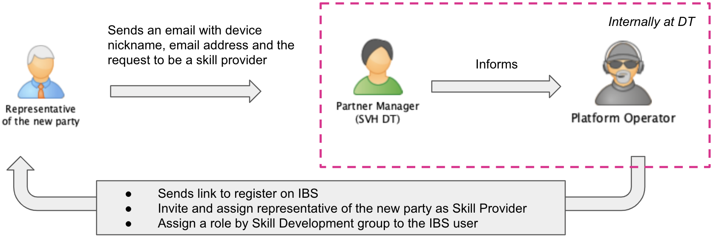

# Skill Provider Registration

This phase is characterised by the formal steps to put the 3rd party into the position to start skill development without further participation of the Magenta Voice operator (legal agreements, 3rd party access to the system).

The above diagram summarises how the Skill Provider registration is done on SDP.

* The representative of the new party sends an email to the Partner manager of Magenta Voice requesting skill provider access.
* The Partner Manager informs the Platform Operator
* The Platform Operator then:
    * Sends link to register on IBS
    * Invites and assign representative of the new party as Skill Provider
    * Assigns a role by Skill Development group to 3rd party's IBS user

The skill provider is able to log into the skill development portal after the successful registration. The link to the skill development portal will be communicated to the representative of the new party in the negotiated contract.
