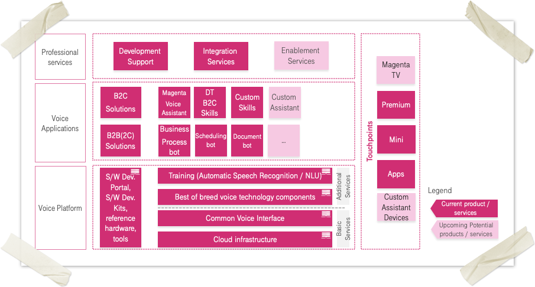

# Telekom Voicification Suite

We understand Voice as a key enabler for seamless processes, personalised experiences and conversational AI solutions for companies and their consumers.

Telekom Voicification Suite is a combined offering of:

1. Voice Platform as a Service (VPaaS) that includes tools to add skills to Magenta Speakers, build new Voice Assistants, integrate voice to mobile applications and much more. 
2. Various Voice Applications built on top of the Voice Platform. These can be used with multiple touch points like Magenta Smart Speakers, Magenta TV, voice integrated mobile apps, etc.
3. Last but not the least the professional services offered to help build voice empowered applications and integrate voice technology in custom B2C and B2B solutions.

The picture below shows the platform offered components, the applications and services offered as part of Telekom Voicification Suite. Most of the components and services are customizable and can be used with or without other provided services.

## Voice Platform as a Service (VPaaS)

Magenta Voice Platform is a technical platform that enables flexible processing of voice interactions. It consists of tools used for the development of Voice Applications both for B2C (Business to Consumer) and B2B (Business to Business) consumers:

1. Basic services like Cloud Infrastructure to host and deploy your applications in containers, Common Voice Interface (referred to as the Core) that is the heart of the Voicification suite orchestrating the invocation of various tasks being performed at the application layer.
2. Additional intelligent services like natural language understanding components, automated speech recognizer, etc.
3. The software development kits that provide you with the way to build custom applications on top of the platform and integrate existing applications or touch points with voice technology.

The voice platform is provided as a service to its consumers. Using VPaaS, you can:

- Create voice skills (capabilities) for the touch points like Magenta Speakers
- Integrate voice to mobile applications
- Enable voice in hardware or IoT devices
- Develop innovative enterprise solutions
- Extend Telekom Voicification Suite itself by adding custom product lines in the Application Catalog

